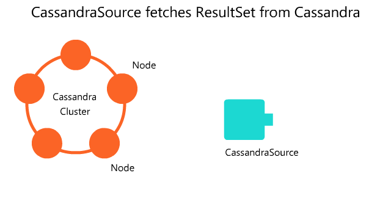
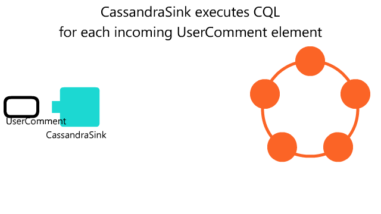
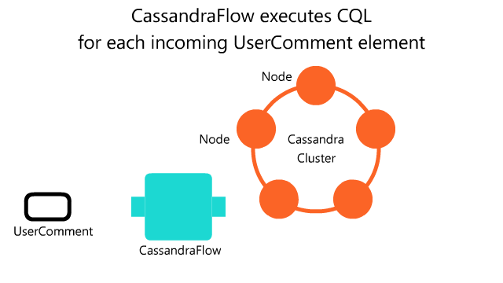

## Background

Enterprise Integration Patterns, EIP, have been a great success in the enterprise world,
which provide reusable architecture patterns to construct complicated systems from simple components.
There have been many systems written in Java following or extending from patterns described in EIP.

However, in recent years there has been a trend to rewrite systems in more stream-based fashion,
given a massive scale of data such enterprise systems need to process every day,
and an increasing business demand for real-time analysis.

Alpakka, which is a Reactive Enterprise Integration library for Java and Scala, based on Reactive Streams and Akka,
is a great fit in this area. It allows you easily connect your systems with other external systems and services, and perform stream-based operations.

In this article, we introduce Alpakka's Cassandra connector as an example, and see what Alpakka gives you over Cassandra's plain Java driver.

## About Alpakka

Alpakka is a community based effort collaborating with Akka maintainers at Lightbend,
and provides a large, and ever increasing number of connectors for files, queues including AMQP and Kafka, AWS/GCP/Azure services, and more.

**************************************
**************************************
QUESTION: Do we want to show the contrast in the number of Alpakka plugins in 2016 abd 2018?
**************************************
**************************************

https://github.com/akka/alpakka
https://akka.io/blog/news/2018/05/02/alpakka-team

Since Alpakka provides the connectors as Akka Stream operators, it's not just easy to connect to these other systems and services,
but you can also benefit from Akka Stream's back-pressure support and fine-grained control over the stream at any level you want.
Akka Stream's flexible DSL makes it easy to combine different operators to perform buffering, throttling, branching, pub/sub, and you can even create your own operators.

## About Cassandra

Cassandra is a database product originally created by Facebook, and known for its great write performance and distributed nature by design.

https://academy.datastax.com/planet-cassandra/what-is-apache-cassandra
http://cassandra.apache.org/

Although Cassandra is different from relational databases in many aspects, its query language CQL has some similarities to SQL,
and Cassandra indeed has a concept of tables.

If you already have existing data stored in Cassandra and want to introduce stream-based operations in your system,
or you have Akka-based or Akka Stream-based systems and looking for a database with great scalability and fault tolerance,
this blog post can be useful for you.

## Examples

****************************************************************************
****************************************************************************
TODO

As said earlier, do buffering, throttling, etc to show benefits of
Akka streams. The current examples are just as boring as plain Cassandra
Java drives.
****************************************************************************
****************************************************************************

The full code example is [here](where?).

### Bring up Cassandra

To follow the examples in this article, you should firstly bring up Cassandra.
If you already have Cassandra up and running, you can skip this section.

The easiest way to bring up Cassandra, if you already have Docker installed, is run it via Docker.
Make sure you expose the port 9042 so that the example code can connect to Cassandra via the port.

```
docker pull cassandra
docker run -p 127.0.0.1:9042:9042 -d cassandra
```

If you are not familiar with Docker, [download Cassandra](http://cassandra.apache.org/download/),
unarchive it, set PATH to the Cassandra bin directory..

### Dependency

To run the examples, you must add the following dependency to your project.

```
libraryDependencies += "com.lightbend.akka" %% "akka-stream-alpakka-cassandra" % "0.19"
```

### CassandraSource example

Alpakka Cassandra has three different connectors, CassandraSource, CassandraSink and CasssandraFlow.

The first example we talk about is CassandraSource, which could be useful when you perform a batch-like operation
against a very large data set.



As you see in the animation, CassandraSource lets you run a CQL query, which fetches data set (ResultSet) from Cassandra,
and passes each Row from the ResultSet as an element going through Akka Stream.
Note that it is not something that keeps polling given some filtering criteria, and that's why it is suitable for batch-like operations.


In a nutshell, you can create and run a stream with Alpakka Cassandra connector like below:

```java
final Statement stmt =
  new SimpleStatement("SELECT * FROM akka_stream_java_test.users").setFetchSize(100);

final RunnableGraph<NotUsed> runnableGraph =
  CassandraSource.create(stmt, session)
    .to(Sink.foreach(row -> System.out.println(row)));

runnableGraph.run(materializer);
```

but we'll see how it works in more detail in this section.

To go through the example code, you firstly need to add following import statements,

```java
// Alpakka Cassandra connector
import akka.stream.alpakka.cassandra.javadsl.CassandraSource;

// For Akka an Akka Stream
import akka.NotUsed;
import akka.actor.ActorSystem;
import akka.stream.ActorMaterializer;
import akka.stream.Materializer;
import akka.stream.javadsl.RunnableGraph;
import akka.stream.javadsl.Sink;

// For Java Cassandra driver
import com.datastax.driver.core.*;
```

and you need to initialize the following stuff before running CassandraSource to connect to Cassandra.

```java
// Make sure you already brought up Cassandra, which is accessible via the host and port below.
// The host and port would be driven from a config in a production environment
// but hardcoding them here for simplicity.
final Session session = Cluster.builder()
  .addContactPoint("127.0.0.1").withPort(9042)
  .build().connect();

// ActorSystem and Materializer are necessary as underlying infrastructure to run Akka Stream
final ActorSystem system = ActorSystem.create();
final Materializer materializer = ActorMaterializer.create(system);
```

If you are not familiar with ActorSystem and Materializer, you can assume that
they are like underlying infrastructure to run Akka Stream.
Typically each of them has only one instance in your application, more precisely,
in your (OS) process.

In a production environment, you should already have a data set in Cassandra, but in this example,
we need to prepare a data set by ourselves before running Akka Stream with CassandraSource.
So let's create a keyspace and a table in Cassandra as follows:

```
CREATE KEYSPACE IF NOT EXISTS akka_stream_java_test \
  WITH REPLICATION = { 'class' :  'SimpleStrategy', 'replication_factor': 1 };

CREATE TABLE akka_stream_java_test.users (
  id int,
  name text,
  age int,
  PRIMARY KEY (id)
);
```

In the example code, we use Java driver to execute them so that you don't need to install
CQL client yourself to connect to Cassandra. Keyspace is what contains Cassandra tables, and you need to declare a replication
strategy when you create a keyspace. After creating the keyspace, you can create a table under it.

Now you can insert data into the table:

```java
for(int i = 1; i <= 1000; i++){
  // For simplicity we use the same name and age in this example
  String name = "John";
  int age = 35;

  // Prepared statement is typical in parameterized queries in CQL (Cassandra Query Language).
  // In production systems, it can be used to guard the statement from injection attacks, similar to SQL prepared statement.
  BoundStatement bound = prepared.bind(i, name, age);
  session.execute(bound);
}
```

Here, if you execute the following query,

```
select * FROM akka_stream_java_test.users ;
```

you will get the result set like below,

```
 id  | age | name
-----+-----+------
 769 |  35 | John
  23 |  35 | John
 114 |  35 | John
 660 |  35 | John
 893 |  35 | John
  53 |  35 | John
 987 |  35 | John
 878 |  35 | John
 110 |  35 | John
 ...
 ...
```

but we will execute this query using CassandraSource.

To supply the query to CassandraSource, you should create a Statement beforehand,
using setFetchSize to set the paging size.

```java
//https://docs.datastax.com/en/developer/java-driver/3.2/manual/paging/
final Statement stmt =
  new SimpleStatement("SELECT * FROM akka_stream_java_test.users").setFetchSize(100);
```

Cassandra Java driver already has a [paging feature](https://docs.datastax.com/en/developer/java-driver/3.2/manual/paging/),
so that you don't need to be afraid of your Cassandra client going out of memory by fetching a huge data set in one go.
Cassandra's paging works nicely with Akka Stream, and on top of it, Akka Stream allows fully non-blocking execution
without Cassandra driver's imperative [async-paging interface](https://docs.datastax.com/en/developer/java-driver/3.2/manual/async/#async-paging).

Finally, you can run the stream like below:

```java
final RunnableGraph<NotUsed> runnableGraph =
  CassandraSource.create(stmt, session)
    .to(Sink.foreach(row -> System.out.println(row)));

runnableGraph.run(materializer);
```

and get the following output.

```
...
Row[829, 35, John]
Row[700, 35, John]
Row[931, 35, John]
Row[884, 35, John]
Row[760, 35, John]
Row[628, 35, John]
Row[498, 35, John]
Row[536, 35, John]
...
```

- Typical cases where this is useful
  - filtering, when you cannot express filtering criteria as CQL (e.g.) it changes by user
  - aggregation
  - throttling, if Source cannot do appropriate back pressuring


### CassandraSink example

The next example we see is CassandraSink, which lets you insert Rows into Cassandra at the end of the stream.

This is useful for more like a real-time system that keeps running where your data goes from a data source and
eventually written into Cassandra.



To run CassandraSink, code would look like below:

```java
final PreparedStatement insertTemplate = session.prepare(
  "INSERT INTO akka_stream_java_test.user_comments (id, user_id, comment) VALUES (uuid(), ?, ?)"
);

BiFunction<UserComment, PreparedStatement, BoundStatement> statementBinder =
  (userData, preparedStatement) -> preparedStatement.bind(userData.userId, userData.comment);

final Sink<UserComment, CompletionStage<Done>> sink =
  CassandraSink.create(2, insertTemplate, statementBinder, session);

source.to(sink).run(materializer);
```

and we go into more detail from here.

In this example, we use a different table from what we used in the CassandraSource example.

```
CREATE TABLE akka_stream_java_test.user_comments (
  id uuid,
  user_id int,
  comment text,
  PRIMARY KEY (id)
);
```

This table is associated with previous `users` table, where `user_comments.user_id` is reference to `users.id`.
However, there is no concept of foreign keys in Cassandra, so your application code needs to make sure the association
is kept tight (e.g. you must not insert a user_comments row with non-existent user_id in users.id).
Anyway, that is beyond the scope of this article, so let's come back to the CassandraSink stuff.

As you have the table in Cassandra, you can now define an associated model class in Java.
```java
public static class UserComment {
  int    userId;
  String comment;

  UserComment(int userId, String comment) {
    this.userId = userId;
    this.comment = comment;
  }
}
```

You need to create a prepared statement, to insert parameterized row into Cassandra.
Prepared statements in Cassandra is similar to that of SQL for relational databases, and they are strong against injection attacks.

```java
final PreparedStatement insertTemplate = session.prepare(
  "INSERT INTO akka_stream_java_test.user_comments (id, user_id, comment) VALUES (uuid(), ?, ?)"
);
```

Next, you need this (probably) unfamiliar-looking `BiFunction`.

```java
BiFunction<UserComment, PreparedStatement, BoundStatement> statementBinder =
  (userComment, preparedStatement) -> preparedStatement.bind(userData.userId, userData.comment);
```

The signature of this `BiFunction` is bit complicated, but it means:
 - takes UserComment as input
 - "bind" it to `PreparedStatement`
 - so that the bound CQL statement can be executed

For easiness, we can provide a data source as simple as:

```java
Source<UserComment, NotUsed> source =
  Source.from(Arrays.asList(1, 2, 3, 4, 5, 6, 7, 8, 9, 10))
    .map(i -> new UserComment(1, "some comment"))
```

and do:

```java
source.to(sink).run(materializer);
```

however, let's do something smarter and more realistic here.

You can use `Source.actorRef` to connect a `Sink` to an `Actor`,

```java
final Source<UserComment, ActorRef> source = Source.actorRef(4, OverflowStrategy.fail());

final ActorRef actorRef =
  source
  .to(sink)           //to() takes the left Materialized value
  .run(materializer); //run() takes the left Materialized value
```

- diagram of materialization

and pass this `ActorRef` to provide input from whatever data source you like.
For example, your data source can be HTTP requests from Akka HTTP server, and you can pass requests to this `ActorRef` after
transforming requests to `UserComment`. Of course, simply another actor can keep sending `UserComment` to this `ActorRef`
to process the elements in the stream.

In the example, it's too much to create an Akka HTTP server or an Akka Actor, so let's do the following to connect the
simple data source of a list of integers with the above actorRef.

```java
Source.from(Arrays.asList(1, 2, 3, 4, 5, 6, 7, 8, 9, 10))
  // throttling the stream so that the Source.actorRef() does not overflow
  .throttle(1, Duration.of(50, ChronoUnit.MILLIS))
  .map(i -> new UserComment(1, "some comment"))
  .to(Sink.actorRef(actorRef, "stream completed"))
  .run(materializer);
```

One thing to note about this example is that you can use mapAsync to improve throughput of the stream.
As discussed previously, Cassandra is known for its great write performance, and is distributed by nature so that your
writes are balanced across different nodes in the Cassandra cluster, not hammering a single node, as long as your table
defines the appropriate persistence key.

So, chances are that you can insert into Cassandra parallelly to achieve faster CassandraSink than your data source,
which contributes to the stability of your entire stream.

```
HOW HOW HOW??? mapasync
HOW HOW HOW???
HOW HOW HOW???
HOW HOW HOW???
HOW HOW HOW???
```

****************************************************************************
****************************************************************************
TODO

For CassandraSink, real-time stream processing can be a good example.
Use parallelism, etc to form a more realistic example
****************************************************************************
****************************************************************************

### CasandraFlow example

- Same 4 points as CassandraSource
- We should not use UNLOGGED batch? It doesn't improve performance unless you are SURE your batch has the same partition key
  - http://batey.info/cassandra-anti-pattern-misuse-of.html



## Integration with akka-persistence-cassandra??

- Maybe 1. write into Cassandra via akka-persistence-cassandra, and 2. read from Cassandra with CassandraSource
 - https://www.beyondthelines.net/computing/akka-persistence/
- Probably goes beyond the scope of this article